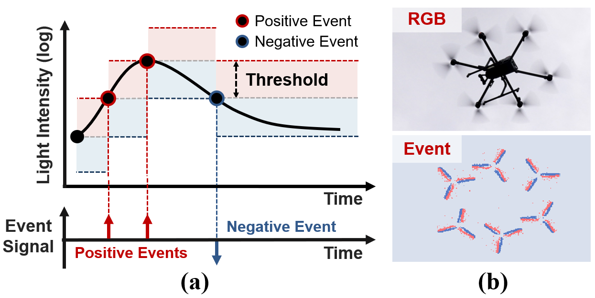
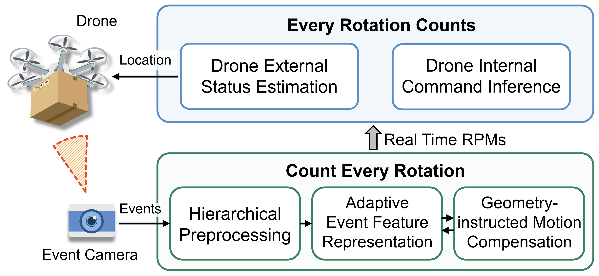
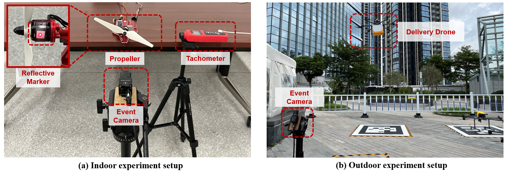

# Demo Video of EventPro

# Event Camera Preliminary

Event cameras are bio-inspired sensors that operate asynchronously and independently for each pixel. Instead of capturing images at a fixed time interval, event cameras record asynchronous changes in pixel brightness, resulting in a stream of events with *microsecond* resolution. When a pixel detects a change in light intensity of a predefined magnitude in the scene, it immediately outputs an event $e_k \doteq \left(\mathbf{x}_k, t_k, p_k\right)$, encoding the triggered position $\mathbf{x}_k$, the triggered time $t_k$, and polarity $p_k$ (+1 for brighter and -1 for darker) of the intensity changes.

# System Overview
We propose **EventPro**, a comprehensive system employing advanced event cameras focusing on propeller rotation to sense drones.
**EventPro** features two components:

- *Count Every Rotation*. We propose an accurate, real-time propeller speed estimation pipeline by mitigating ultra-high sensitivity of event cameras to environmental noise.

- *Every Rotation Counts*. Based on the estimatd propeller speed, we propose algorithms to accurately infer both the drone internal flight commands and external flight status.

# Implementation
We implement **EventPro** with a commercial event camera, the Prophesee EVK4 HD evaluation kit, which is equipped with the IMX636ES event-based vision sensor for high-definition event data capture (1280 × 720 pixels) using the Soyo SFA0820-5M lens. Our implementation contains more than 20000 LOC (lines of Python code). **EventPro** operates on a laptop equipped with an Intel i7-12900K CPU, and 32GB RAM, running on the Ubuntu 20.04 operating system. The event camera is connected to the laptop via USB 3.0.

# Experiment Setup

## Indoor Experiments
We build a laboratory testbed featuring a rotating propeller mounted on a brushless motor shaft. The setup comprises a laptop and an Arduino Uno to control the motor's speed by adjusting the duty cycle and frequency of the PWM signal. The laptop transmits the PWM parameters to the Arduino Uno via a serial port, which then relays the PWM signal to the motor's Electronic Speed Controller (ESC). An event camera was positioned in front of the propeller.

## Outdoor Experiments
We adopt a commercial delivery drone and conduct real-world experiments in a test field. This drone is manufactured by a company specializing in daily and city-wide instant delivery services. The drone features six propellers attached to brushless motors and is controlled by a PX4 flight controller. An event camera was positioned on a ground-based bracket to capture the drone in flight.

## Code
Code will be made publicly available before publication.

